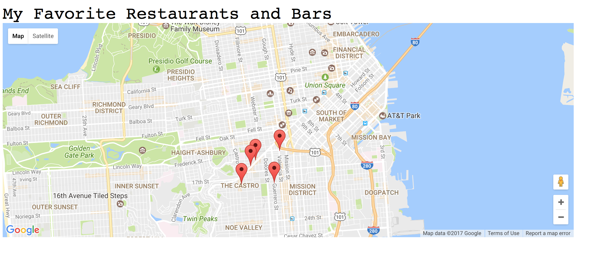
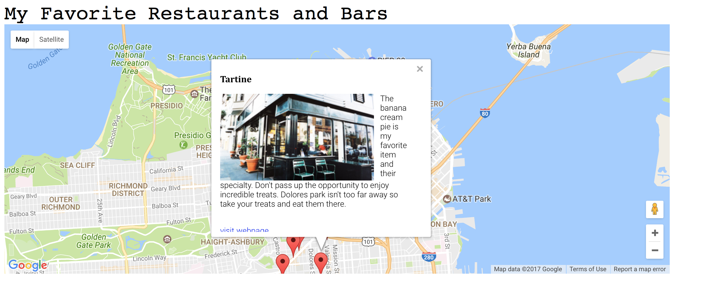

# googleMaps

<h1>the main page</h1>

I used the google maps API and javascript to add pins to a map. The map opens on a particular location (san francisco)

<h1>pop up windows</h1>

I used the API to add pop up windows the the map when the markers are clicked. The pop ups display information about the loctions I dropped my markers on. They also link to their yelp pages and display images of the locations

